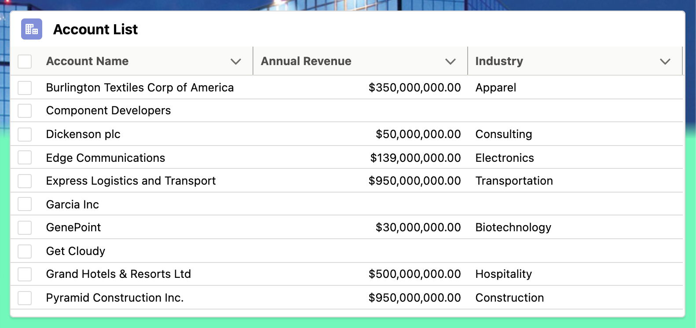
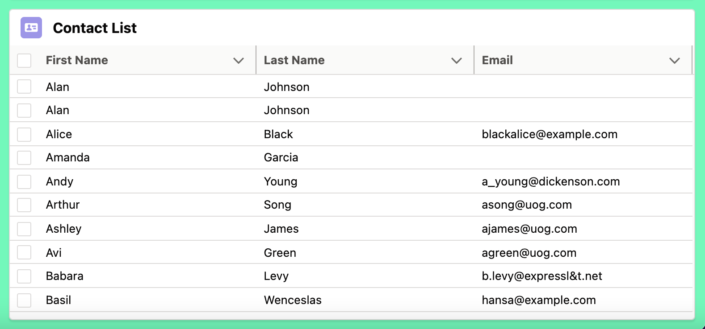

# Record List LWC
LWC displaying a datatable for an object in Salesforce



### AccountList Component
```html
<template>
    <lightning-card title="Account List" icon-name="standard:account">
        <template if:true={accounts.data}>
            <lightning-datatable
                key-field="Id"
                data={accounts.data}
                columns={columns}
            >
            </lightning-datatable>
        </template>
        <template if:true={errors}>
            <p>{errors}</p>
        </template>
    </lightning-card>
</template>
```
```js
import { LightningElement, wire } from 'lwc';
import NAME_FIELD from '@salesforce/schema/Account.Name';
import REVENUE_FIELD from '@salesforce/schema/Account.AnnualRevenue';
import INDUSTRY_FIELD from '@salesforce/schema/Account.Industry';
import getAccounts from '@salesforce/apex/AccountController.getAccounts';
import { reduceErrors } from 'c/ldsUtils';
const COLUMNS = [
    { label: 'Account Name', fieldName: NAME_FIELD.fieldApiName, type: 'text' },
    { label: 'Annual Revenue', fieldName: REVENUE_FIELD.fieldApiName, type: 'currency' },
    { label: 'Industry', fieldName: INDUSTRY_FIELD.fieldApiName, type: 'text' }
];

export default class AccountList extends LightningElement {
    columns = COLUMNS;
    @wire(getAccounts)
    accounts;
    get errors() {
        return (this.accounts.error) ?
            reduceErrors(this.accounts.error) : [];
    }
}
```
### AccountController
```cls
public with sharing class AccountController {
    public static List<Account> getAllActiveAccounts() {
      return [SELECT Id,Name,Active__c FROM Account WHERE Active__c = 'Yes'];
    }
    @AuraEnabled(cacheable=true)
    public static List<Account> getAccounts() {
      return [SELECT Name, AnnualRevenue, Industry FROM Account ORDER BY Name LIMIT: 10];
      //throw new AuraHandledException('Forced error');
    }
    @AuraEnabled(cacheable=true)
    public static List<Contact> getRelatedContacts(Id accountId) {
      return [SELECT Name, Title, Email, Phone FROM Contact WHERE AccountId = :accountId];
    }
  }
```



### ContactList Component
```html
<template>
    <lightning-card title="Contact List" icon-name="standard:contact">
        <template if:true={contacts.data}>
            <lightning-datatable
            key-field="Id"
            data={contacts.data}
            columns={columns}
            >
            </lightning-datatable>
        </template>
        <template if:true={errors}>
            <p>{errors}</p>
        </template>
    </lightning-card>
</template>
```
```js
import { LightningElement, wire } from 'lwc';
import FIRSTNAME_FIELD from '@salesforce/schema/Contact.FirstName';
import LASTNAME_FIELD from '@salesforce/schema/Contact.LastName';
import EMAIL_FIELD from '@salesforce/schema/Contact.Email';
import getContacts from '@salesforce/apex/ContactController.getContacts';
import { reduceErrors } from 'c/ldsUtils';
const COLUMNS = [
    { label: 'First Name', fieldName: FIRSTNAME_FIELD.fieldApiName, type: 'text' },
    { label: 'Last Name', fieldName: LASTNAME_FIELD.fieldApiName, type: 'text' },
    { label: 'Email', fieldName: EMAIL_FIELD.fieldApiName, type: 'text' }
];

export default class ContactList extends LightningElement {
    columns = COLUMNS;
    @wire(getContacts)
    contacts;
    get errors() {
        return (this.contacts.error) ?
            reduceErrors(this.contacts.error) : [];
    }
}
```
### ContactController
```cls
public with sharing class ContactController {
    @AuraEnabled(cacheable=true)
    public static List<Contact> getContacts() {
        return [SELECT FirstName, LastName, Email FROM Contact ORDER BY FirstName, LastName LIMIT: 10];
        //throw new AuraHandledException('Forced error');
    }
}
```

